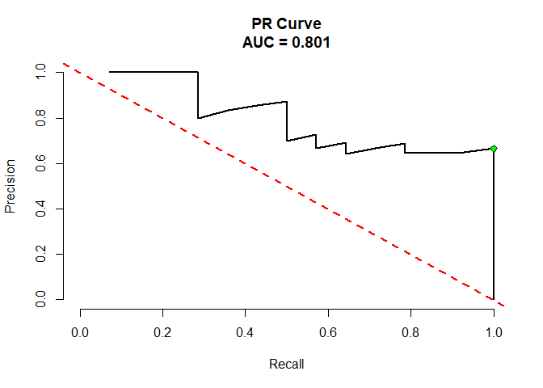

<!-- README.md is generated from README.Rmd. Please edit that file -->

# ROCcurve

<!-- badges: start -->
<!-- badges: end -->

The goal of ROCcurve is to …

## Installation

You can install the development version of ROCcurve from
[GitHub](https://github.com/) with:

``` r
# install.packages("devtools")
devtools::install_github("tswanson222/ROCcurve")
```

## Example

This is a basic example which shows you how to solve a common problem:

``` r
library(ROCcurve)

# Fit a model with only one predictor
roc1 <- ROCcurve(y = mtcars$vs, X = mtcars$mpg)

# Or with multiple predictors
roc2 <- ROCcurve(y = mtcars$vs, X = mtcars[, 1:4])

summary(roc2)
#>   type       AUC    cutoff sensitivity specificity       PPV       NPV
#> 1  ROC 0.9642857 0.5141417   0.9285714   0.9444444 0.9285714 0.9444444
#> 2  PRC 0.9469660 0.5141417   0.9285714   0.9444444 0.9285714 0.9444444

# plot the ROC curve
plot(roc1)
```


``` r
# plot the PR curve
plot(roc1, type = 'prc')
```


``` r

# Fit PR curves
prc <- ROCcurve(y = mtcars$vs, X = mtcars$wt, prc = TRUE)

plot(prc)
```



``` r
summary(prc)
#>   type       AUC   cutoff sensitivity specificity       PPV NPV
#> 1  ROC 0.8412698 0.278402           1   0.6111111 0.6666667   1
#> 2  PRC 0.8005955 0.278402           1   0.6111111 0.6666667   1

# Conduct an AUC test
auc_test(mtcars, 'am', 'mpg', 'disp', nboot = 100, seed = 91, verbose = FALSE)
#>   type       mpg      disp    sd_diff         D    pvalue
#> 1  ROC 0.8299595 0.8663968 0.03265908 -1.115685 0.2645569
```
